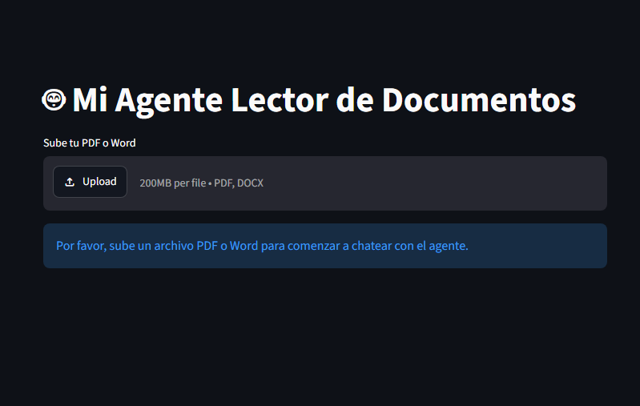
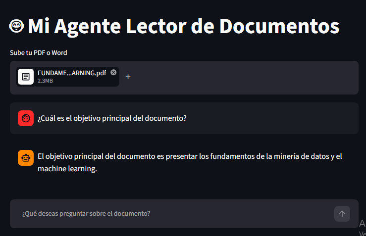

# 🤖 Doc RAG Assistant

Proyecto desarrollado como parte del Challenge de Alura Latam y Oracle Next Education (ONE).

El objetivo de este proyecto es crear un agente o asistente de IA,  capaz de responder preguntas utilizando únicamente la información contenida en un documento PDF o Word, usando la arquitectura Retrieval-Augmented-Generation (RAG)

El usuario carga un documento, realiza una pregunta y el sistema busca la información más relevante antes de generar una respuesta.

---

# Tecnologías utilizadas

- Python 3.14
- Streamlit
- LangChain
- Google Gemini
- Hugging Face Embeddings
- FAISS
- PyPDF
- Docx2txt

---

# ¿Cómo funciona?

El funcionamiento del proyecto es el siguiente:

1. El usuario carga un documento PDF o DOCX.
2. El documento se divide en pequeños fragmentos de texto.
3. Cada fragmento se convierte en un embedding utilizando Hugging Face.
4. Los embeddings se almacenan en una base de datos vectorial FAISS.
5. Cuando el usuario realiza una pregunta, esta también se transforma en un embedding.
6. FAISS busca los fragmentos del documento con mayor similitud.
7. Gemini utiliza esos fragmentos como contexto para generar la respuesta.

De esta forma el modelo responde utilizando la información del documento y disminuye la posibilidad de inventar respuestas.

---

# Instalación

Clonar el repositorio

```bash
git clone https://github.com/TU_USUARIO/TU_REPOSITORIO.git
```

Entrar al proyecto

```bash
cd TU_REPOSITORIO
```

Crear un entorno virtual

```bash
python -m venv .venv
```

Activar el entorno

Windows

```bash
.venv\Scripts\activate
```

Linux

```bash
source .venv/bin/activate
```

Instalar dependencias

```bash
pip install -r requirements.txt
```

---

# Configuración

Crear la carpeta

```
.streamlit
```

Dentro crear el archivo

```
secrets.toml
```

Agregar la API Key

```toml
GEMINI_API_KEY="TU_API_KEY"
```

---

# Ejecutar la aplicación

```bash
streamlit run app.py
```

---

# Ejemplos de preguntas

- ¿Cuál es el objetivo principal del documento?
- Resume el contenido.
- ¿Qué requisitos aparecen en el documento?
- ¿Qué tecnologías se mencionan?
- ¿Cuáles son las conclusiones?

---

# Estructura del proyecto

```
.
│
├── app.py
├── requirements.txt
├── README.md
├── .gitignore
├── .streamlit/
│   └── secrets.toml
└── documentos/
```

---

## Capturas

### Aplicación



### Consulta al documento



### Despliegue en OCI

####[OCI](images/deploy_oci.png)

---

# Posibles mejoras

- Soporte para archivos CSV.
- Base de datos vectorial persistente.
- Historial de conversaciones permanente.
- Soporte para múltiples documentos.
- Despliegue mediante Docker.

---

# Autor

Proyecto desarrollado por **Jurgen Beroiza** para el Challenge de Alura Latam y Oracle Next Education.